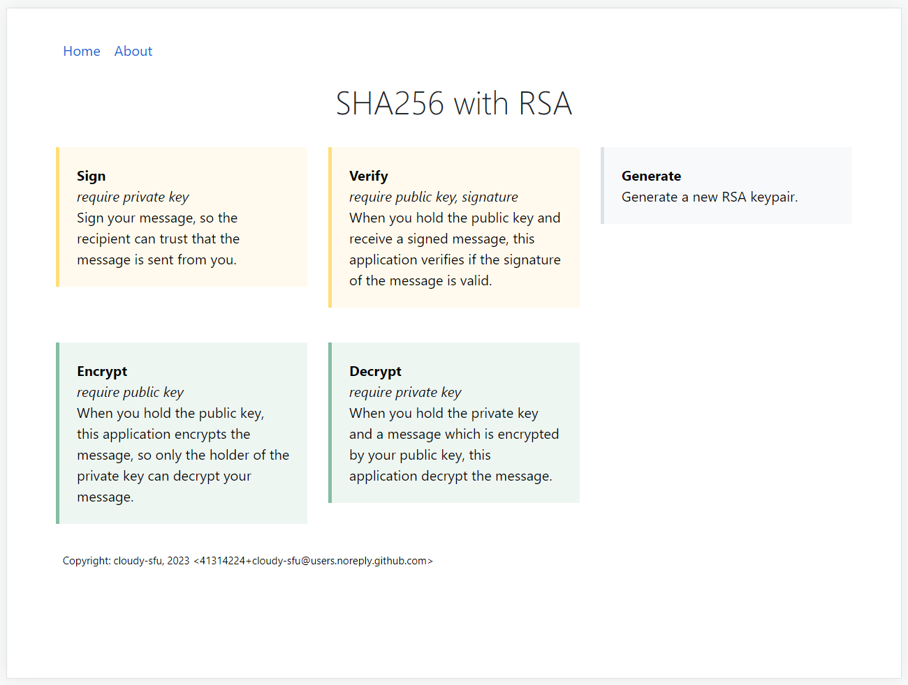

# SHA256withRSA

 The SHA256withRSA Algorithm with GUI


## Introduction

It is a web-based GUI for SHA256withRSA operations as follows. 

-   Generate keypairs
-   Encrypt and decrypt messages
-   Sign messages and verify signatures

It automatically starts service at localhost.

Screenshot:



## Usage

**End user**: Download from the latest release, unzip and run `SHA256withRSA.exe`.

**Developer**:

```bash
pip install -r requirements.txt
pyinstaller main.spec
```
