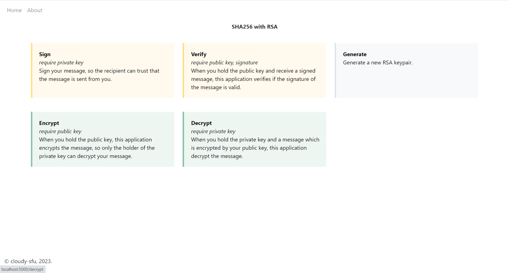

# SHA256withRSA

 The SHA256withRSA Algorithm with GUI


## Introduction

It is a web-based GUI for SHA256withRSA operations as follows. 

-   Generate keypairs
-   Encrypt and decrypt messages
-   Sign messages and verify signatures

<details>
    <summary><b>Screenshot</b></summary>
    
</details>

## Usage

**Source code:**

1. Set the project root as the current folder in terminal. 

2. Activate Python virtual environment if applicable.

3. Run the following script. 

   ```bash
   pip install -r requirements.txt
   python -m flask run 
   ```

It occupies localhost 5000 port by default.

- [Customize host of Flask application](https://flask.palletsprojects.com/en/2.3.x/quickstart/)
- [Customize port of Flask application](https://flask.palletsprojects.com/en/2.3.x/server/#address-already-in-use)

**Release:**

1. Download and unzip the release.
2. Open `SHA256withRSA.exe`.
