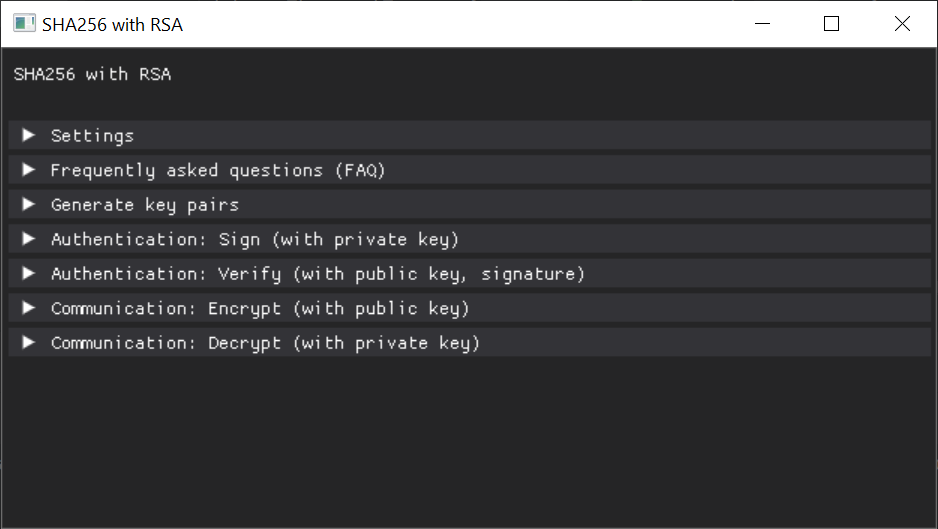

# SHA256 with RSA

 The SHA256withRSA Algorithm with GUI


## Introduction

It is a GUI for SHA256withRSA operations as follows.

-   Generate keypairs
-   Encrypt and decrypt messages
-   Sign messages and verify signatures




## Usage

**Source code:**

1. Set the project root as the current folder in terminal. 

2. Activate Python virtual environment if applicable.

3. Run the following script. 

   ```shell
   pip install -r requirements.txt
   pyinstaller gui_win_cn.spec
   move dist\SHA256-with-RSA-CN\_internal\SourceHanSansCN-Regular.otf dist\SHA256-with-
   RSA-CN\SourceHanSansCN-Regular.otf
   ```

**Release:**

1. Download and unzip the release.
2. Open `SHA256-with-RSA.exe`.

